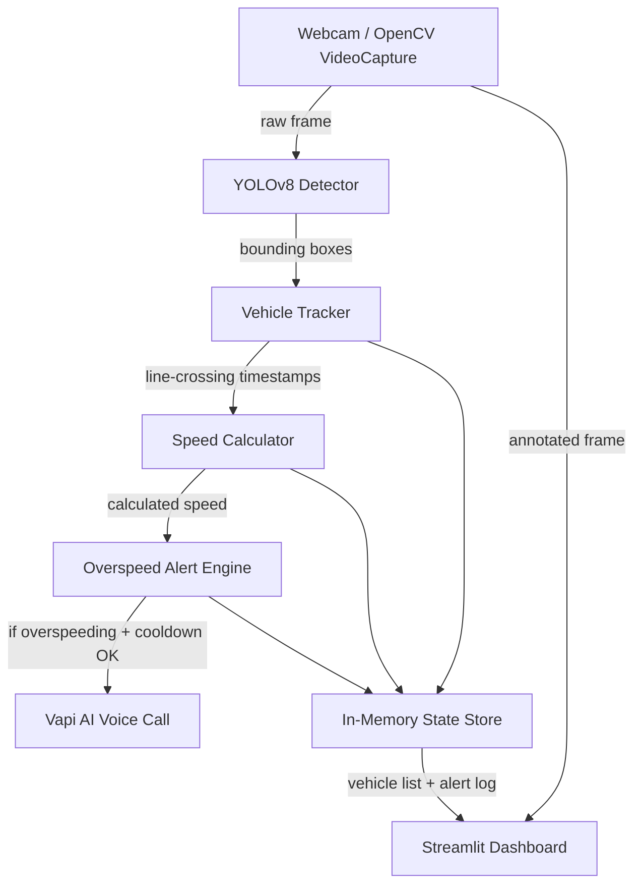
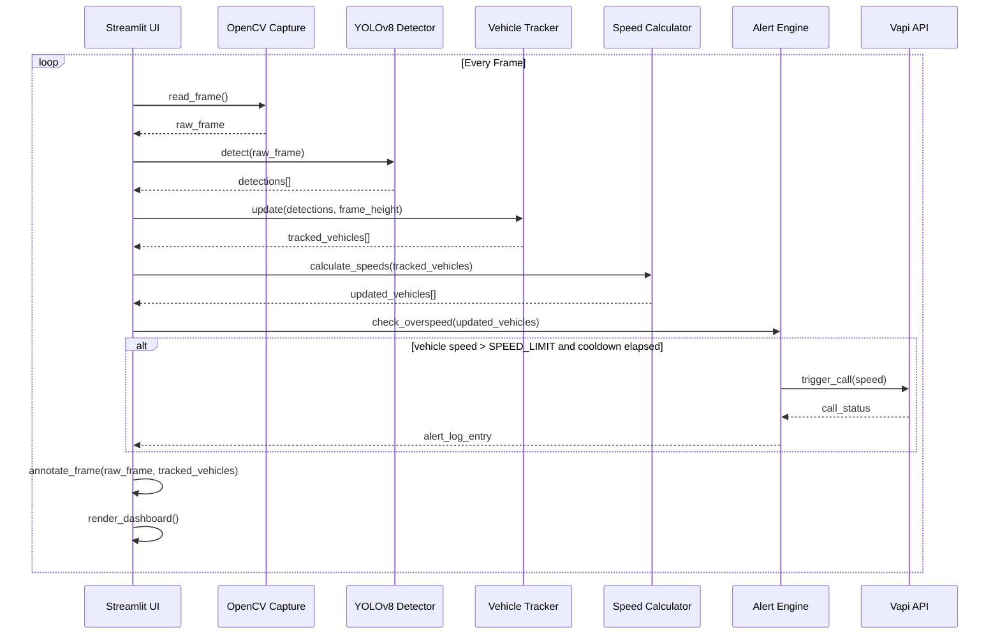
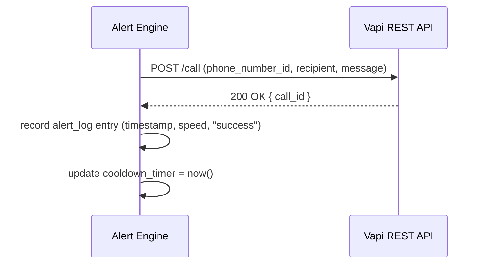

# Design Document: Road Guard

## Overview

Road Guard is a proof-of-concept intelligent traffic enforcement system that uses a laptop webcam and computer vision to detect vehicles, simulate speed measurement, and automatically trigger an AI-powered voice call alert when a vehicle exceeds the configured speed limit.

The system captures a live webcam feed, runs YOLOv8 nano object detection to identify vehicles, calculates simulated speed by measuring the time a vehicle takes to cross two horizontal trigger lines, and — when overspeeding is detected — fires an outbound Vapi AI voice call to an alert recipient. All state is held in memory; there is no database. The UI is a Streamlit dashboard with a dark theme showing the annotated live feed, real-time speed readouts, an alert log, and a configuration sidebar.

The design covers both the high-level architecture (component relationships, data flow, sequence diagrams) and the low-level implementation (interfaces, algorithms, formal specifications).

---

## Architecture



---

## Sequence Diagrams

### Main Processing Loop



### Vapi Call Flow



---

## Components and Interfaces

### Component 1: Frame Capture (`capture.py`)

**Purpose**: Wraps OpenCV `VideoCapture` to provide frames to the rest of the pipeline.

**Interface**:
```python
class FrameCapture:
    def __init__(self, source: int = 0) -> None: ...
    def read_frame(self) -> tuple[bool, np.ndarray]: ...
    def release(self) -> None: ...
    @property
    def frame_width(self) -> int: ...
    @property
    def frame_height(self) -> int: ...
```

**Responsibilities**:
- Open and manage the webcam device
- Return raw BGR frames on demand
- Expose frame dimensions for line position calculation

---

### Component 2: Vehicle Detector (`detector.py`)

**Purpose**: Runs YOLOv8 nano inference on a frame and returns bounding boxes for vehicle classes.

**Interface**:
```python
class VehicleDetector:
    def __init__(self, model_path: str = "yolov8n.pt") -> None: ...
    def detect(self, frame: np.ndarray) -> list[Detection]: ...
```

```python
@dataclass
class Detection:
    vehicle_id: str        # assigned by tracker, empty at detection stage
    bbox: BoundingBox      # x1, y1, x2, y2 in pixels
    confidence: float
    class_name: str        # "car", "truck", "bus", "motorcycle"
```

**Responsibilities**:
- Load YOLOv8 nano model once at startup
- Filter detections to vehicle classes only (car, truck, bus, motorcycle)
- Return normalised bounding boxes

---

### Component 3: Vehicle Tracker (`tracker.py`)

**Purpose**: Assigns persistent IDs to detections across frames and records line-crossing timestamps.

**Interface**:
```python
class VehicleTracker:
    def __init__(self, line1_y: float, line2_y: float) -> None: ...
    def update(
        self,
        detections: list[Detection],
        frame_height: int
    ) -> list[TrackedVehicle]: ...
```

```python
@dataclass
class TrackedVehicle:
    vehicle_id: str
    bbox: BoundingBox
    line1_timestamp: float | None   # epoch seconds
    line2_timestamp: float | None
    calculated_speed: float | None  # km/h equivalent
    is_overspeeding: bool
```

**Responsibilities**:
- Match detections to existing tracked vehicles using IoU overlap
- Assign new IDs to unmatched detections
- Record `time.time()` when vehicle centroid crosses LINE_1_Y then LINE_2_Y
- Evict vehicles that have not been seen for N frames

---

### Component 4: Speed Calculator (`speed.py`)

**Purpose**: Computes simulated speed from line-crossing timestamps.

**Interface**:
```python
class SpeedCalculator:
    def __init__(
        self,
        pixel_to_speed_multiplier: float,
        speed_limit: float
    ) -> None: ...
    def calculate(self, vehicle: TrackedVehicle) -> TrackedVehicle: ...
```

**Responsibilities**:
- Compute speed only when both timestamps are present
- Apply `PIXEL_TO_SPEED_MULTIPLIER` to produce a speed value
- Set `is_overspeeding = True` when speed exceeds `SPEED_LIMIT`

---

### Component 5: Alert Engine (`alert.py`)

**Purpose**: Decides whether to fire a Vapi call and manages the cooldown timer.

**Interface**:
```python
class AlertEngine:
    def __init__(
        self,
        vapi_api_key: str,
        phone_number_id: str,
        recipient_number: str,
        cooldown_seconds: int = 60
    ) -> None: ...
    def check_and_alert(self, vehicles: list[TrackedVehicle]) -> AlertEntry | None: ...
```

```python
@dataclass
class AlertEntry:
    timestamp: str          # ISO-8601
    speed: float
    call_status: str        # "success" | "failed" | "cooldown"
```

**Responsibilities**:
- Scan vehicle list for any `is_overspeeding == True`
- Enforce cooldown: skip call if `now - last_call_time < COOLDOWN_SECONDS`
- POST to Vapi REST API
- Append result to `alert_log`

---

### Component 6: Streamlit Dashboard (`app.py`)

**Purpose**: Entry point and UI layer — orchestrates all components and renders the dashboard.

**Responsibilities**:
- Load config from environment / `.env`
- Instantiate all components
- Run the per-frame processing loop inside `st.empty()` placeholders
- Render annotated frame, speed table, alert log, and config sidebar

---

## Data Models

### BoundingBox

```python
@dataclass
class BoundingBox:
    x1: int
    y1: int
    x2: int
    y2: int

    @property
    def center_x(self) -> int: return (self.x1 + self.x2) // 2
    @property
    def center_y(self) -> int: return (self.y1 + self.y2) // 2
```

### TrackedVehicle (full)

```python
@dataclass
class TrackedVehicle:
    vehicle_id: str
    bbox: BoundingBox
    line1_timestamp: float | None = None
    line2_timestamp: float | None = None
    calculated_speed: float | None = None
    is_overspeeding: bool = False
    frames_since_seen: int = 0
```

**Validation Rules**:
- `vehicle_id` must be non-empty
- `line2_timestamp >= line1_timestamp` when both are set
- `calculated_speed >= 0` when set

### AlertEntry

```python
@dataclass
class AlertEntry:
    timestamp: str
    speed: float
    call_status: str  # "success" | "failed" | "cooldown"
```

### In-Memory State (held in `app.py` session state)

```python
detected_vehicles: list[TrackedVehicle]   # active tracked vehicles
alert_log: list[AlertEntry]               # all alert events this session
cooldown_timer: float                     # epoch seconds of last call
```

---

## Algorithmic Pseudocode

### Main Per-Frame Algorithm

```pascal
ALGORITHM process_frame(capture, detector, tracker, speed_calc, alert_engine, state)
INPUT:  live webcam frame
OUTPUT: annotated frame, updated state

BEGIN
  ok, frame ← capture.read_frame()
  IF NOT ok THEN
    RETURN error_frame
  END IF

  detections ← detector.detect(frame)

  tracked_vehicles ← tracker.update(detections, capture.frame_height)

  FOR each vehicle IN tracked_vehicles DO
    vehicle ← speed_calc.calculate(vehicle)
  END FOR

  alert_entry ← alert_engine.check_and_alert(tracked_vehicles)
  IF alert_entry IS NOT NULL THEN
    state.alert_log.append(alert_entry)
  END IF

  state.detected_vehicles ← tracked_vehicles

  annotated ← annotate_frame(frame, tracked_vehicles, state.line1_y_px, state.line2_y_px)

  RETURN annotated, state
END
```

**Preconditions:**
- `capture` is open and returning valid frames
- `detector` model is loaded
- `state` is initialised

**Postconditions:**
- `state.detected_vehicles` reflects current frame
- `state.alert_log` grows by at most 1 entry per frame
- Returned frame has bounding boxes, lines, and speed labels drawn

**Loop Invariants:**
- Each vehicle in `tracked_vehicles` has a unique `vehicle_id`
- `alert_log` entries are append-only and ordered by time

---

### Vehicle Tracking Algorithm

```pascal
ALGORITHM tracker_update(detections, frame_height, existing_vehicles)
INPUT:  detections[]  — new bounding boxes from detector
        frame_height  — pixel height of frame
        existing_vehicles[] — vehicles from previous frame
OUTPUT: updated tracked_vehicles[]

BEGIN
  line1_px ← LINE_1_Y * frame_height
  line2_px ← LINE_2_Y * frame_height

  // Match detections to existing vehicles by IoU
  matched_pairs, unmatched_detections, lost_vehicles ←
      iou_match(detections, existing_vehicles, threshold=0.3)

  FOR each (detection, vehicle) IN matched_pairs DO
    vehicle.bbox ← detection.bbox
    vehicle.frames_since_seen ← 0

    cy ← vehicle.bbox.center_y

    IF vehicle.line1_timestamp IS NULL AND cy >= line1_px THEN
      vehicle.line1_timestamp ← time.time()
    END IF

    IF vehicle.line1_timestamp IS NOT NULL
       AND vehicle.line2_timestamp IS NULL
       AND cy >= line2_px THEN
      vehicle.line2_timestamp ← time.time()
    END IF
  END FOR

  FOR each detection IN unmatched_detections DO
    new_vehicle ← TrackedVehicle(
      vehicle_id = generate_id(),
      bbox = detection.bbox
    )
    existing_vehicles.append(new_vehicle)
  END FOR

  // Age out vehicles not seen recently
  existing_vehicles ← FILTER existing_vehicles
    WHERE frames_since_seen < MAX_FRAMES_MISSING

  FOR each vehicle IN existing_vehicles
    WHERE vehicle NOT IN matched_pairs DO
    vehicle.frames_since_seen += 1
  END FOR

  RETURN existing_vehicles
END
```

**Preconditions:**
- `LINE_1_Y < LINE_2_Y` (line 1 is above line 2 in the frame)
- `frame_height > 0`

**Postconditions:**
- Every returned vehicle has a unique, stable `vehicle_id`
- `line1_timestamp` is always set before `line2_timestamp`
- Vehicles missing for `>= MAX_FRAMES_MISSING` frames are removed

**Loop Invariants:**
- IoU matching is injective: each detection maps to at most one existing vehicle
- Timestamps are monotonically non-decreasing per vehicle

---

### Speed Calculation Algorithm

```pascal
ALGORITHM calculate_speed(vehicle, pixel_to_speed_multiplier, speed_limit)
INPUT:  vehicle — TrackedVehicle with optional timestamps
OUTPUT: vehicle with calculated_speed and is_overspeeding set

BEGIN
  IF vehicle.line1_timestamp IS NULL OR vehicle.line2_timestamp IS NULL THEN
    RETURN vehicle  // not enough data yet
  END IF

  delta_t ← vehicle.line2_timestamp - vehicle.line1_timestamp

  IF delta_t <= 0 THEN
    RETURN vehicle  // guard against clock anomalies
  END IF

  vehicle.calculated_speed ← pixel_to_speed_multiplier / delta_t

  IF vehicle.calculated_speed > speed_limit THEN
    vehicle.is_overspeeding ← TRUE
  ELSE
    vehicle.is_overspeeding ← FALSE
  END IF

  RETURN vehicle
END
```

**Preconditions:**
- `pixel_to_speed_multiplier > 0`
- `speed_limit > 0`

**Postconditions:**
- `calculated_speed >= 0`
- `is_overspeeding` is set if and only if `calculated_speed > speed_limit`

**Loop Invariants:** N/A

---

### Alert Engine Algorithm

```pascal
ALGORITHM check_and_alert(vehicles, cooldown_timer, cooldown_seconds,
                           vapi_api_key, phone_number_id, recipient)
INPUT:  vehicles[]       — current tracked vehicles
        cooldown_timer   — epoch time of last successful call
        cooldown_seconds — minimum gap between calls
OUTPUT: AlertEntry or NULL

BEGIN
  overspeeding ← FILTER vehicles WHERE is_overspeeding = TRUE

  IF overspeeding IS EMPTY THEN
    RETURN NULL
  END IF

  now ← time.time()

  IF (now - cooldown_timer) < cooldown_seconds THEN
    RETURN AlertEntry(timestamp=iso(now), speed=max_speed(overspeeding),
                      call_status="cooldown")
  END IF

  max_speed_vehicle ← MAX(overspeeding BY calculated_speed)

  status ← vapi_call(
    api_key       = vapi_api_key,
    phone_id      = phone_number_id,
    recipient     = recipient,
    message       = "Alert from Road Guard. A vehicle is overspeeding. Please slow down immediately."
  )

  IF status = SUCCESS THEN
    cooldown_timer ← now
    RETURN AlertEntry(timestamp=iso(now),
                      speed=max_speed_vehicle.calculated_speed,
                      call_status="success")
  ELSE
    RETURN AlertEntry(timestamp=iso(now),
                      speed=max_speed_vehicle.calculated_speed,
                      call_status="failed")
  END IF
END
```

**Preconditions:**
- `cooldown_seconds > 0`
- Vapi credentials are non-empty strings

**Postconditions:**
- At most one Vapi call is made per invocation
- `cooldown_timer` is updated only on a successful call
- Returned `AlertEntry.call_status` ∈ {"success", "failed", "cooldown"}

**Loop Invariants:** N/A

---

## Key Functions with Formal Specifications

### `annotate_frame(frame, vehicles, line1_y_px, line2_y_px) -> np.ndarray`

**Preconditions:**
- `frame` is a valid BGR numpy array with shape `(H, W, 3)`
- `0 < line1_y_px < line2_y_px < H`

**Postconditions:**
- Returns a new frame (copy) with bounding boxes, vehicle IDs, speed labels, and trigger lines drawn
- Original `frame` is not mutated
- Overspeeding vehicles have bounding boxes drawn in red; others in green

---

### `iou_match(detections, vehicles, threshold) -> (matched, unmatched_det, unmatched_veh)`

**Preconditions:**
- `0 < threshold <= 1`

**Postconditions:**
- Each detection appears in exactly one of `matched` or `unmatched_det`
- Each vehicle appears in exactly one of `matched` or `unmatched_veh`
- All matched pairs have IoU >= threshold

---

### `vapi_call(api_key, phone_id, recipient, message) -> str`

**Preconditions:**
- `api_key`, `phone_id`, `recipient`, `message` are non-empty strings
- `recipient` is a valid E.164 phone number

**Postconditions:**
- Returns `"success"` on HTTP 200/201 from Vapi
- Returns `"failed"` on any HTTP error or network exception
- No retry logic — single attempt only

---

## Example Usage

```python
# app.py bootstrap (simplified)
from dotenv import load_dotenv
import os, streamlit as st

load_dotenv()

PIXEL_TO_SPEED_MULTIPLIER = float(os.getenv("PIXEL_TO_SPEED_MULTIPLIER", "3000"))
SPEED_LIMIT               = float(os.getenv("SPEED_LIMIT", "60"))
COOLDOWN_SECONDS          = int(os.getenv("COOLDOWN_SECONDS", "60"))
LINE_1_Y                  = float(os.getenv("LINE_1_Y", "0.4"))
LINE_2_Y                  = float(os.getenv("LINE_2_Y", "0.6"))
VAPI_API_KEY              = os.getenv("VAPI_API_KEY")
VAPI_PHONE_NUMBER_ID      = os.getenv("VAPI_PHONE_NUMBER_ID")
ALERT_RECIPIENT_NUMBER    = os.getenv("ALERT_RECIPIENT_NUMBER")

capture  = FrameCapture(source=0)
detector = VehicleDetector(model_path="yolov8n.pt")
tracker  = VehicleTracker(line1_y=LINE_1_Y, line2_y=LINE_2_Y)
speed    = SpeedCalculator(PIXEL_TO_SPEED_MULTIPLIER, SPEED_LIMIT)
alert    = AlertEngine(VAPI_API_KEY, VAPI_PHONE_NUMBER_ID,
                       ALERT_RECIPIENT_NUMBER, COOLDOWN_SECONDS)

frame_placeholder = st.empty()

while True:
    ok, frame = capture.read_frame()
    if not ok:
        break
    detections       = detector.detect(frame)
    tracked          = tracker.update(detections, capture.frame_height)
    tracked          = [speed.calculate(v) for v in tracked]
    entry            = alert.check_and_alert(tracked)
    if entry:
        st.session_state.alert_log.append(entry)
    annotated = annotate_frame(frame, tracked,
                               int(LINE_1_Y * capture.frame_height),
                               int(LINE_2_Y * capture.frame_height))
    frame_placeholder.image(annotated, channels="BGR")
```

---

## Correctness Properties

- For all vehicles v: if `v.line2_timestamp` is set, then `v.line1_timestamp` is also set and `v.line1_timestamp <= v.line2_timestamp`
- For all vehicles v: `v.is_overspeeding == True` if and only if `v.calculated_speed > SPEED_LIMIT`
- For all alert entries e: `e.call_status ∈ {"success", "failed", "cooldown"}`
- The Vapi call is never triggered more than once within any `COOLDOWN_SECONDS` window
- `alert_log` entries are strictly ordered by timestamp (append-only)
- `LINE_1_Y < LINE_2_Y` is a system invariant enforced at startup
- No API keys or secrets appear in any log output or UI element

---

## Error Handling

### Webcam Unavailable

**Condition**: `cv2.VideoCapture.read()` returns `ok=False`
**Response**: Display error message in Streamlit UI; stop the processing loop
**Recovery**: User restarts the app after reconnecting the camera

### YOLOv8 Model Not Found

**Condition**: `yolov8n.pt` not present and download fails
**Response**: Surface exception with a clear message; abort startup
**Recovery**: User manually downloads the model or checks internet connectivity

### Vapi API Error

**Condition**: HTTP 4xx/5xx or network timeout from Vapi
**Response**: Log `AlertEntry` with `call_status="failed"`; do not update `cooldown_timer`
**Recovery**: Next overspeeding event will retry (subject to cooldown)

### Missing Environment Variables

**Condition**: `VAPI_API_KEY`, `VAPI_PHONE_NUMBER_ID`, or `ALERT_RECIPIENT_NUMBER` is `None`
**Response**: Raise `ValueError` at startup with a descriptive message listing missing keys
**Recovery**: User populates `.env` and restarts

### Clock Anomaly (delta_t <= 0)

**Condition**: `line2_timestamp - line1_timestamp <= 0` due to system clock issues
**Response**: Skip speed calculation for that vehicle; leave `calculated_speed = None`
**Recovery**: Automatic — next valid crossing pair will be used

---

## Testing Strategy

### Unit Testing Approach

Test each component in isolation with mocked dependencies:
- `SpeedCalculator`: verify speed formula, boundary at `SPEED_LIMIT`, `delta_t <= 0` guard
- `AlertEngine`: verify cooldown logic, call status mapping, no-call when no overspeeding vehicles
- `VehicleTracker`: verify ID stability across frames, line-crossing timestamp assignment order
- `annotate_frame`: verify output shape matches input, no mutation of input frame

### Property-Based Testing Approach

**Property Test Library**: `hypothesis`

Key properties to test:
- For any pair of timestamps where `t2 > t1 > 0` and `multiplier > 0`: `calculated_speed > 0`
- For any `calculated_speed <= SPEED_LIMIT`: `is_overspeeding == False`
- For any `calculated_speed > SPEED_LIMIT`: `is_overspeeding == True`
- Tracker never assigns the same `vehicle_id` to two different vehicles in the same frame
- Alert engine never fires two calls within `COOLDOWN_SECONDS` regardless of input sequence

### Integration Testing Approach

- Feed a pre-recorded video file (instead of webcam) through the full pipeline and assert that vehicles crossing both lines produce speed values and that overspeeding triggers an alert log entry (with Vapi mocked)

---

## Performance Considerations

- YOLOv8 nano is chosen specifically for low latency on CPU; GPU acceleration via CUDA is optional
- Frame processing should target >= 15 FPS; if inference is slower, consider skipping every other frame
- In-memory state lists should be bounded: evict vehicles missing for `MAX_FRAMES_MISSING` (default 30) frames to prevent unbounded growth
- `alert_log` is session-scoped and small by design (one entry per 60-second cooldown window)

---

## Security Considerations

- All secrets (`VAPI_API_KEY`, `VAPI_PHONE_NUMBER_ID`, `ALERT_RECIPIENT_NUMBER`) are loaded from `.env` via `python-dotenv`; `.env` is listed in `.gitignore`
- No secrets are rendered in the Streamlit UI or written to logs
- The Vapi call payload contains only a fixed alert message — no vehicle data or PII is transmitted
- The system is local-only (no inbound network exposure); Streamlit runs on `localhost`

---

## Dependencies

| Package | Purpose |
|---|---|
| `streamlit` | Dashboard UI |
| `opencv-python` | Webcam capture and frame annotation |
| `ultralytics` | YOLOv8 nano model |
| `requests` | Vapi REST API calls |
| `python-dotenv` | `.env` secret loading |
| `hypothesis` | Property-based testing |
| `pytest` | Unit and integration test runner |
